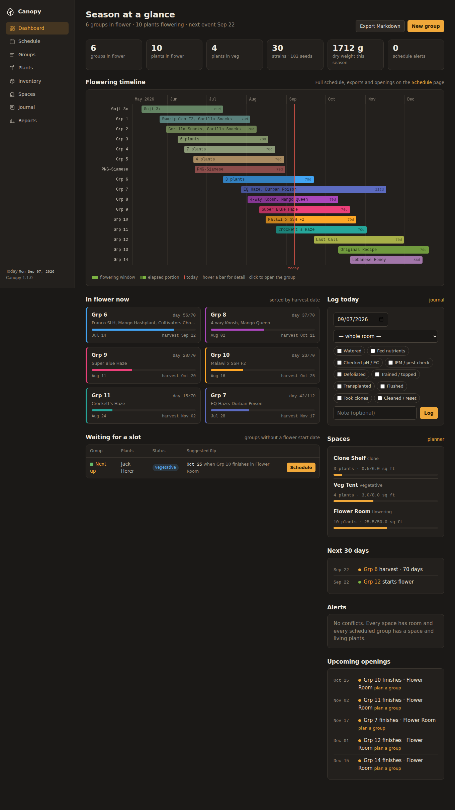

# Canopy

Cultivation planning for small grow rooms: a seed and clone **inventory**, plants organised
into **groups**, and a flowering **schedule** that is computed from each group's flip date
rather than typed in by hand. Canopy tells you what is in flower today, when each group
comes down, which slots free up next, and where a waiting group could go.



## What it does

| Area | What you can do |
| --- | --- |
| **Dashboard** | Season timeline (Gantt), groups in flower with day counters, next 30 days of milestones, schedule alerts, upcoming openings, and one‑click scheduling for groups waiting on a slot. |
| **Schedule** | Full event table (every start and end of flower), openings, conflicts, print view, Markdown export (bulleted groups + event table + ASCII timeline for Joplin/Obsidian/GitHub), JSON backup and restore. |
| **Groups** | Create batches, set flip date and flower days, assign a space, track status (planned → vegetative → flowering → drying → done), record harvests and journal entries, accept a suggested flip date. |
| **Plants** | Individual plants of a strain in a group, with status, start/end dates, kill reason, notes; filter by status, group or strain. |
| **Inventory** | Strains with breeder, lineage, seed type, expression (sativa/haze/indica/hybrid), default flower days and seed count with +/− adjusters. Search plus stacking filters on type, expression, breeder and flower length; every column sorts. |
| **Spaces & planner** | Clone shelf, veg tent, flower tent — each with a stage, dimensions and a maximum. Canopy shows where every plant is, how much room is left, how many more fit (by strain size class), a season load chart for the flower tent, and what each waiting group needs. |
| **Journal & quick log** | One‑click daily log with task checkboxes (watered, fed, pH/EC, IPM, defoliated…), plus longer dated notes. "Last watered / fed" on every group. |
| **Reports** | Survival per strain, why plants were lost, tent load over the season. |
| **API** | Read/write JSON at `/api/v1/*` for scripts, dashboards and Claude Code. |

## Quick start

Requires Python 3.11+.

```bash
python -m venv .venv && source .venv/bin/activate   # Windows: .venv\Scripts\activate
pip install -r requirements.txt
flask --app wsgi init-db
flask --app wsgi seed-demo          # optional: load the 2026 demo season
flask --app wsgi run --debug        # http://127.0.0.1:5000
```

Or with Docker:

```bash
docker compose up --build           # http://localhost:8000, data persisted in a named volume
```

`make install`, `make seed`, `make run`, `make test`, `make lint`, `make screenshots` and
`make docker` wrap the same commands.

## Configuration

All settings are environment variables (see `.env.example`):

| Variable | Default | Purpose |
| --- | --- | --- |
| `CANOPY_SECRET_KEY` | `dev-only-change-me` | Signs sessions and CSRF tokens. **Set this in production.** |
| `CANOPY_DATABASE_URL` | `sqlite:///instance/canopy.db` | Any SQLAlchemy URL (SQLite, PostgreSQL, MySQL). |
| `CANOPY_TODAY` | real date | Pin "today" (`YYYY-MM-DD`) for demos, screenshots and deterministic tests. |
| `CANOPY_DEFAULT_FLOWER_DAYS` | `70` | Default flower length for new groups and strains. |
| `CANOPY_FOOTPRINT_CLONE` / `_VEG` / `_FLOWER` | `0.1,0.15,0.2` / `0.5,0.75,1` / `1.5,2.25,3` | Square feet per plant for small, medium, large strains at each stage — drives the planner's fit estimates. |

## Command line

```
flask --app wsgi init-db          # create tables
flask --app wsgi seed-demo        # load demo season (no-op if data exists)
flask --app wsgi reset-db         # drop and recreate (asks for confirmation)
flask --app wsgi export-markdown  # groups + schedule table + ASCII timeline to stdout
flask --app wsgi export-json      # full backup to stdout
```

## Development

```bash
pip install -r requirements-dev.txt
pytest --cov=canopy               # 65+ tests, ~97% coverage
ruff check canopy tests && ruff format canopy tests
playwright install chromium       # once, for screenshots
python scripts/screenshots.py && python scripts/annotate.py
```

## Project layout

```
canopy/                 application package (Flask app factory in __init__.py)
  config.py             Config / TestConfig, environment variables
  extensions.py         SQLAlchemy + CSRF singletons
  models.py             Space, Strain, Group, Plant, Harvest, JournalEntry
  forms.py              WTForms definitions
  cli.py                flask CLI commands
  services/
    scheduling.py       events, timeline rows, openings, suggestions, conflicts, exports
    spacing.py          plant locations, footprints, occupancy, fit estimates, load series
    reports.py          per-strain and per-group aggregations
    transfer.py         JSON backup / restore
    seed.py             demo dataset
  blueprints/           one module per screen + api.py
  templates/            Jinja2 (base.html, _macros.html, one folder per blueprint)
  static/css/app.css    design tokens and components (no framework)
  static/js/timeline.js Gantt renderer (vanilla JS)
tests/                  pytest suite (models, scheduling, routes, api, cli)
scripts/                screenshots.py, annotate.py
docs/                   user guide, technical guide, API reference, design notes, screenshots
```

## Documentation

* [User guide](docs/user-guide.md) — every screen, annotated.
* [Technical guide](docs/technical.md) — architecture, data model, scheduling algorithms, security, deployment.
* [API reference](docs/api.md) — `/api/v1` endpoints with examples.
* [Design notes](docs/design.md) — visual system and UX principles.
* [Backlog](docs/backlog.md) — candidate features, roughly prioritised.
* [Changelog](CHANGELOG.md)
* [CLAUDE.md](CLAUDE.md) — conventions for working on this codebase with Claude Code.

## License

MIT — see `LICENSE`.
