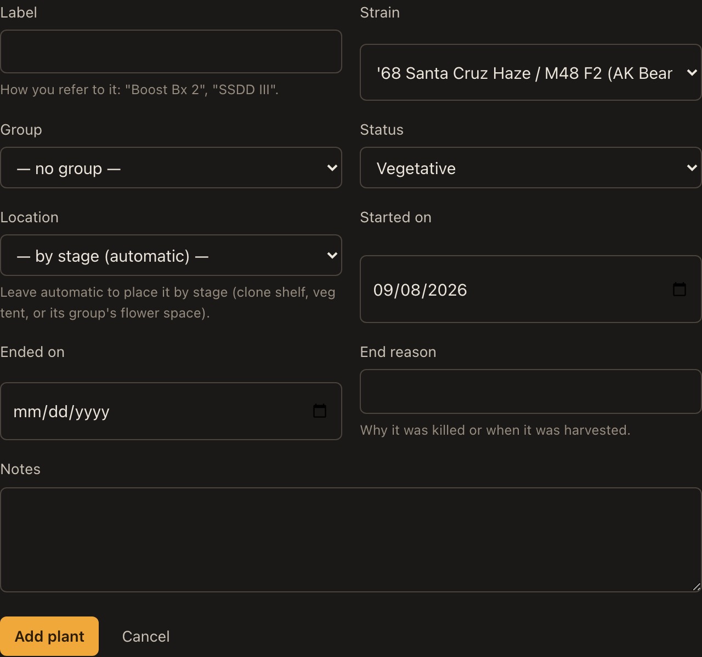
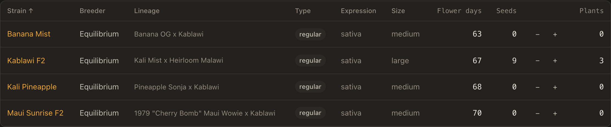
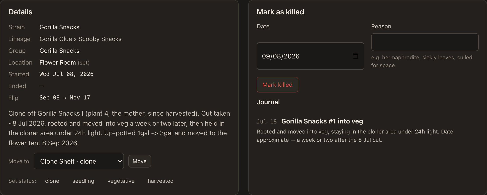
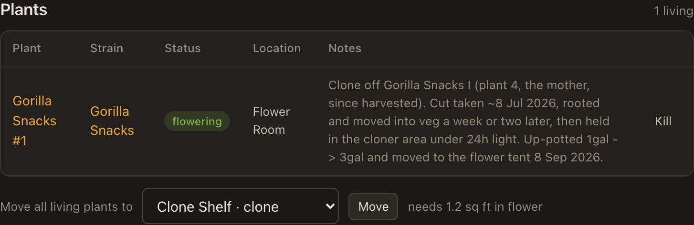

# Plant lifecycle — how transitions work today

Every plant moves through some path like this:

```
                   ┌─────────────────────────────────────────┐
                   ▼                                         │
seed ──▶ seedling ──▶ vegetative ──▶ flowering ──▶ harvested  │
                          ▲              │                    │
clone ────────────────────┴──────────────┘  (back to veg) ────┘
  ▲                       │              │
  └───────────────────────┴──────────────┘  (take cuttings)

any living plant ──▶ killed
```

Long-flowering plants — hazes especially — often skip veg and go from clone
straight into flower. Indicas and hybrids usually veg first.

This document walks each transition as the app works **today**, then sets out where
it is clunky and what would fix it.

---

## The one thing to understand first

**Plant-level actions and group-level actions do different things.**

A plant's own page moves *that plant* and changes *that plant's* status. Nothing else
happens. A group's page moves **every living plant in the group**, and — when the
destination is a flowering space — also sets the group's space and its flip date,
which is what puts it on the schedule.

So: use the plant page for individuals, the group page when a batch flips together.
A flowering plant with no group never appears on the timeline, in events, or in any
harvest projection.

---

## 1. Start a seed from the collection

**Inventory → find the strain → note the seed count → Plants → Add plant.**



Set **Status** to `seedling`, pick the **Strain**, and optionally a **Group** and a
**Location**. Leave Location blank and the plant is placed by its status — a seedling
with no explicit space shows up in the first vegetative space.



Then go back to Inventory and press **−** to drop the seed count.

> **The two halves are not connected.** Starting a seed does not decrement
> `seeds_on_hand`; you do it by hand, on a different page. Nothing stops the count
> drifting from reality.

## 2. Take in a clone from outside the collection

Same form, **Status** = `clone`, **Location** = your clone shelf.

If the strain is new, add it first at **Inventory → Add strain**. Set its seed type
to `clone` so the inventory reads honestly — you hold a cutting, not seeds.

> Nothing records that a plant came from outside. The only trace is whatever you
> write in its notes.

## 3. Clone straight into flower (the haze path)

**Plant page → Move to → your flower space → Move.**



Moving into a flowering space sets the plant's status to `flowering` automatically —
that is `spacing.move_plants()` aligning status with the destination's stage.

**But the plant is now flowering with no flip date**, because flip dates live on
groups. To get it on the schedule, either put it in a group first and move the
*group*, or create a group for it and set the flip date by hand.

## 4. Veg it first (the indica / hybrid path)

**Plant page → Move to → your veg space → Move.** Status becomes `vegetative`.

For a whole batch, use the group page instead:



**Move all living plants to → Veg Tent.** A `planned` group becomes `vegetative`.

## 5. A veg plant generates a clone

**There is no action for this.** Cloning is the most common thing you do and the app
has no button for it.

What you do instead:

1. **Plants → Add plant**, same strain, **Status** = `clone`, **Location** = clone shelf
2. Label it yourself so the parentage is guessable — `Mango Hashplant #7`
3. Write the parent into the notes, because nothing links them
4. Log **Took clones** in the journal against the space, separately

Repeat per cutting. Nineteen mothers cloned twice each is 38 hand-created rows.

> Nothing connects a cutting to the plant it came off. `Plant` has no `parent_id`.

## 6. Veg → flower

For a batch, the group page: **Move all living plants to → your flower space.**

This is the one action that does everything at once — it moves the plants, flips
their status to `flowering`, assigns the group's space, and **sets the flip date to
today if it was blank**. From that moment the group appears on the timeline with a
projected harvest date.

For one plant, the plant page's **Move to**, with the caveat in §3.

## 7. Kill anything, any time

**Plant page → Mark as killed**, with a date and a reason.

Killed plants stay on the record. They drop out of living counts, capacity and strain
summaries, but keep their reason and show struck through in the Markdown export —
which is what makes the survival and loss reports mean anything.

## 8. Flowering → cuttings

Same as §5. Nothing about a plant being in flower changes how you take a clone from
it, and nothing records that a mother was cloned before harvest.

## 9. Flowering → harvest

Two steps, both on the group page:

1. **Set status → `drying`** (or `done`). Every living plant in the group flips to
   `harvested` and gets an end date — the group's flower end, or today.
2. **Harvest → Record a harvest**, with a wet weight for the whole group or one plant.

Step 1 is what ends the plants. Step 2 is optional and only records weight.

## 10. Flowering → back to veg

**Plant page → Move to → your veg space.** Status returns to `vegetative`.

> This works per plant, but the group keeps its flip date and stays on the timeline.
> Reverting a whole group means moving the plants *and* editing the group to clear its
> flip date.

---

## Where this is clunky

**Cloning has no action.** The most frequent operation in the garden is manual data
entry, one row at a time, with the parent recorded only in prose. Two separate
occasions in this database needed a human to explain a lineage the app could not show.

**Lineage is invisible.** `Plant` has no `parent_id`. The Gorilla Snacks line —
mother harvested, her clone now in flower, a cutting off that clone on the shelf — is
three rows that only a human reading three notes can connect.

**Starting a seed doesn't spend one.** Two pages, two actions, no link.

**The app stores state, not history.** A plant has one `status`, one `started_on` and
one `ended_on`. There is no record that it spent 40 days in veg before flipping, or
that it sat on the clone shelf for two months. That history exists only if you wrote a
journal note, and the journal is deliberately inert — nothing reads it back.

**Plant-level and group-level actions diverge silently.** Moving a plant into flower
makes it flowering but invisible to the schedule. Moving a *group* into flower puts it
on the timeline. Nothing on either page says so.

**Containers aren't modelled**, so the same plant in a 16oz cup and a 3-gallon pot are
identical to the planner. See backlog #16.

---

## What would fix it

### A. A lifecycle event log — the foundation

One append-only table: `plant_id`, `on`, `from_status`, `to_status`, `space_id`, `note`.
Every move, status change, kill and harvest writes a row. Nothing else changes shape.

That single table gives you:

* **a real history per plant** — "clone 8 Jul → veg 18 Jul → flower 8 Sep", derived, not typed
* **days in each stage**, so you can tell what actually vegged for six weeks
* **a visual lifecycle strip** on the plant page: a horizontal bar segmented by stage,
  the same visual language as the group timeline you already have
* **honest answers** to "how long does this strain take from cut to harvest", across runs

This is worth doing before the rest. Every other improvement gets better with it.

### B. A "Take clones" action

A button on any living plant: how many, into which space. It creates N children with
`parent_id` set, on the clone shelf, labelled from the mother, and writes a lifecycle
event on both sides. One action replaces 38 manual rows.

### C. Lineage on the plant page

With `parent_id`, a plant page can show *taken from* and *cuttings taken*, each a link.
The Gorilla Snacks line becomes clickable instead of three notes.

### D. Spend a seed when you start one

`plants.create` decrements `seeds_on_hand` when the status is `seedling` and the strain
holds seeds, with a flash saying so. Inventory stops drifting.

### E. Say what an action will do

The group page's move already does four things at once and says none of them. A line
under the control — "will flip Grp 26 and set today as the flip date" — costs nothing
and removes the main surprise.

---

## Suggested order

1. **Lifecycle event log** (A) — everything else reads better with it
2. **Take clones** (B) and **lineage** (C) — the two that remove real daily work
3. **Seed decrement** (D) and **action previews** (E) — small, independent
4. Then the space-model work already in the backlog (#16–19), which fixes the
   footprint estimates these workflows keep tripping over

None of this is built. It is a proposal, recorded here so the shape is agreed before
any of it is written.
