# Canopy user guide

Canopy keeps three things in step: what seeds and clones you have, which plants are
running together as a group, and when each group flips and comes down. You enter a flip
date and a flower length; Canopy works out everything else.

Screenshots use the demo season (`flask --app wsgi seed-demo`) with today pinned to
7 September 2026. Numbered callouts refer to the lists under each image.

## The vocabulary

| Term | Meaning |
| --- | --- |
| **Strain** | An entry in your inventory: name, breeder, lineage, seed type, default flower days, seeds on hand. |
| **Plant** | One physical plant. Always of one strain, usually in one group. |
| **Group** | A batch of plants flipped to flower together. Has a number (Grp 1, Grp 2…) or a name (Goji 3x). |
| **Flip** | The day a group goes to 12/12. Stored as *flower start*. |
| **Flower days** | Days from flip to harvest. The harvest (end) date is always `flip + flower days`. |
| **Space** | A shelf, tent or room with a **stage** (clone, vegetative, flowering), dimensions and a maximum plant count. |
| **Location** | Where a plant is right now. Set it explicitly, or Canopy infers it: clones and seedlings on the clone-stage space, veg plants in the veg-stage space, flowering plants in their group's space. |
| **Size class** | Per strain: small, medium or large. With the space's stage it sets the plant's footprint in square feet, which is how Canopy estimates how many fit. |
| **Opening** | A date a space frees up because a group finishes and nothing starts that day. |
| **Status** | Group: planned → vegetative → flowering → drying → done. Plant: clone, seedling, vegetative, flowering, harvested, killed. |
| **Task** | A checkbox in the quick log: watered, fed, pest/mold treatment, defoliated, trained, transplanted, flushed, took clones, cleaned. |

## Dashboard

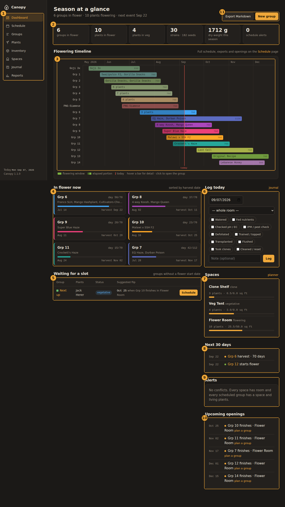

1. **Navigation.** Every screen is one click away. The current page is highlighted.
2. **Season stats.** Groups in flower, plants in flower, plants in veg, inventory size
   and the number of schedule alerts (turns red when there are any).
3. **Flowering timeline.** One bar per scheduled group, coloured to match the group,
   labelled with its strains and flower length. The darker left part of a bar is the
   elapsed portion; the red line is today. Hover a bar for dates, day count and plant
   list; click it to open the group. Scrolls sideways on narrow screens.
4. **In flower now.** A card per active group, sorted by harvest date, with day-of-flower,
   a progress bar and the harvest date.
5. **Waiting for a slot.** Groups without a flip date, each with the earliest suggested
   opening ("Oct 25 when Grp 10 finishes in Flower Room"). **Schedule** sets the flip
   date and space in one click.
6. **Log today.** One section per space. Tick what you did in that tent, add an optional
   note, **Log**. The entry's title is built from the ticks. Nothing is required beyond
   saying something — a bare note is a valid entry.
7. **Spaces.** Every space with its plant count and square feet in use. Red when over
   capacity. Links to the planner.
8. **Next 30 days.** Upcoming milestones: green dot = flip, amber dot = harvest.
9. **Alerts.** Groups scheduled without a space or without living plants, and status/date
   mismatches. Space capacity is *not* here — it is a label on the spaces page, because it
   is an estimate rather than something broken.
10. **Upcoming openings.** When each slot frees up; **plan a group** opens the new‑group
    form pre‑filled with that date and space.
11. **Actions.** Export the schedule as Markdown or start a new group.

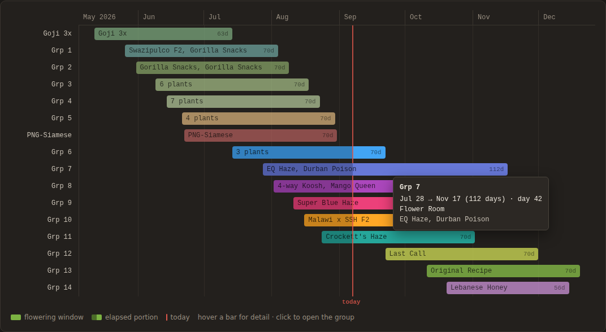

## Schedule

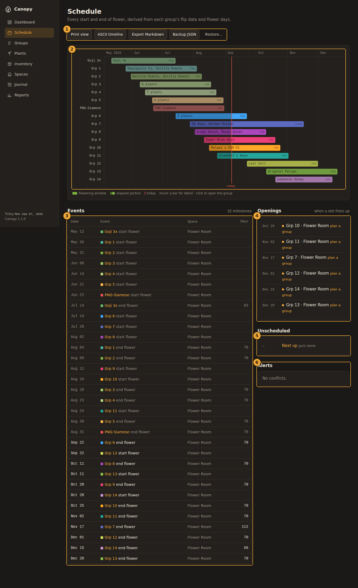

1. **Toolbar.** *Print view* (a clean black‑on‑white page that opens the print dialog),
   *ASCII timeline* (plain text that renders in any monospace box), *Export Markdown*
   (see below), *Backup JSON* (full database) and *Restore…*.
2. **Timeline.** Same Gantt as the dashboard.
3. **Events.** Every start and end of flower. Click any column header to sort by it —
   newest date first by default. Past rows are dimmed, today's row is highlighted, and
   future rows are tinted and tagged *upcoming*. On a day where one group ends and
   another starts, the end is listed first.
4. **Openings.** Dates a space becomes free, with a shortcut to plan a group on that date.
5. **Unscheduled.** Groups that still need a flip date.
6. **Alerts.** The same conflict checks as the dashboard.

### Markdown export

The export reproduces the format many growers keep in a notes app:

```markdown
## Groups
- **Grp 1** — Swazipulco F2, Gorilla Snacks I
  killed: ~~Lemon Lime Haze 1~~
...
## Schedule
| date | event |
| ---: | --- |
| Sep 22 | Grp 6 end flower (70 days) |
| Sep 22 | Grp 12 start flower |
...
## Timeline
(ASCII Gantt inside a code fence)
```

The ASCII timeline uses only `=`, `+`, `-`, `|` and `*`, so it survives Joplin,
Obsidian, GitHub, email and terminals without alignment problems.

### Backup and restore

*Backup JSON* downloads everything (spaces, strains, groups, plants, harvests, journal).
*Restore…* accepts that file; with **Replace all existing data** ticked it wipes the
database first, otherwise it appends. IDs are re‑mapped so relations survive.

## Groups

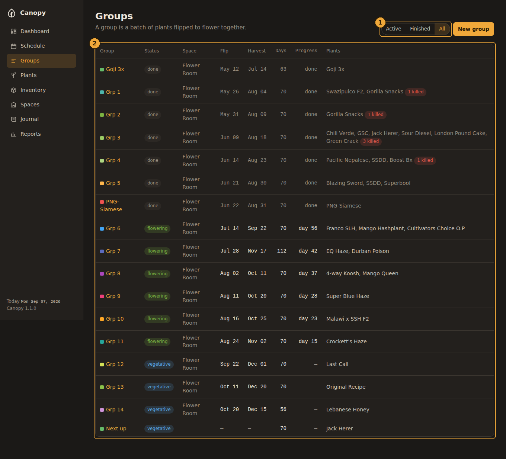

1. **Filter.** *Active* hides finished groups, *Finished* shows only them, *All* shows both.
2. **Table.** Status badge, space, flip and harvest dates, flower days, current day of
   flower, and the living strains (with a red count of killed plants where relevant).

### Group detail

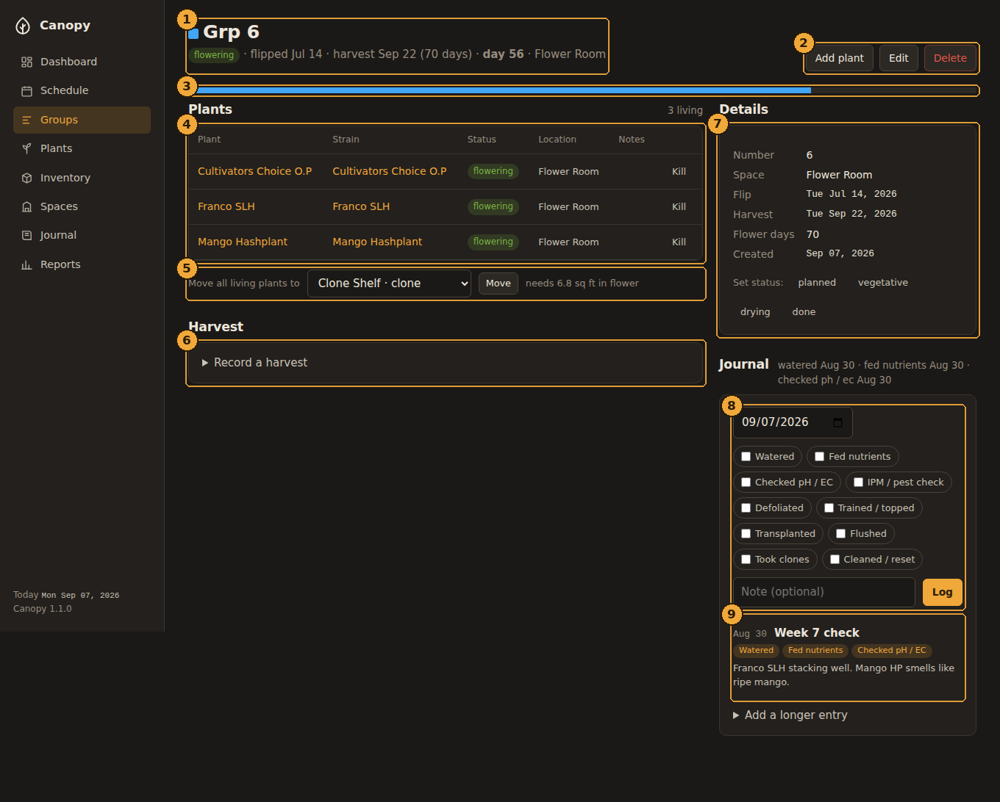

1. **Header.** Status, flip date, harvest date, flower length, day of flower and space.
2. **Actions.** Add a plant (pre‑assigned to this group), edit, or delete. Deleting a group
   keeps its plants and simply unassigns them.
3. **Progress.** Elapsed share of the flowering window, in the group's colour.
4. **Plants.** Every plant with strain, status, location and notes. **Kill** marks a
   plant killed today with reason "Culled"; use the plant page for a specific date or
   reason. Killed plants stay listed, dimmed, so the record is complete.
5. **Move all living plants to…** one action to walk a whole group from the clone shelf
   to the veg tent to the flower tent. Plant statuses follow the destination stage; moving
   into a flower space also sets the group's space and flip date if they were blank. The
   line shows how many square feet the group needs in flower.
6. **Harvest.** Record the wet weight for the whole group or a single plant; the total
   appears in the section heading.
7. **Details and status.** Key dates and a row of status buttons. Marking a group
   *flowering* moves its living plants to flowering (and sets today as the flip date if
   none was set); marking it *drying* or *done* moves flowering plants to harvested.
8. **Quick log** for this group — same checkboxes as the dashboard, attached to this
   group rather than to a space.
9. **Journal.** Entries newest first with task chips; a longer titled entry can be added
   below.

When the calendar disagrees with the stored status (for example a group whose harvest
date has passed but is still marked flowering), a banner offers to correct it.

### Scheduling a waiting group

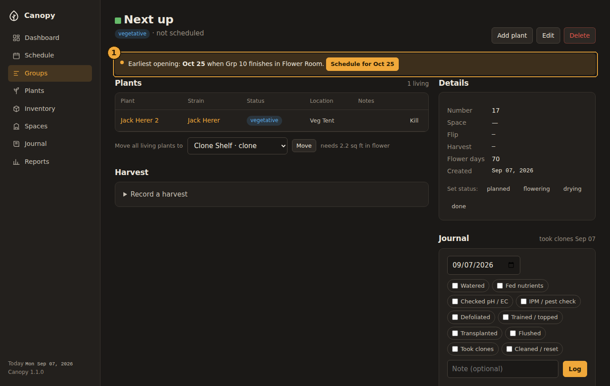

1. A group without a flip date shows the earliest opening. **Schedule for Oct 25** sets
   the flip date, assigns the space that frees up, and moves the group to vegetative.

### Killed plants

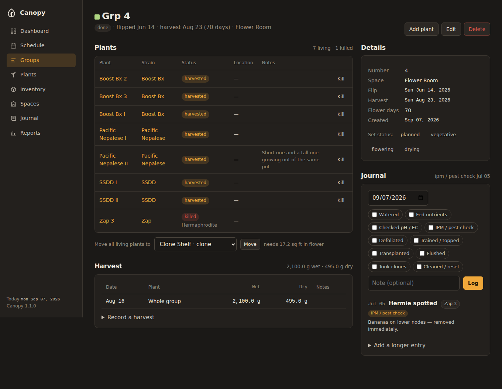

Killed plants keep their reason and date, are excluded from strain summaries and capacity
counts, and are struck through in the Markdown export.

### New group form

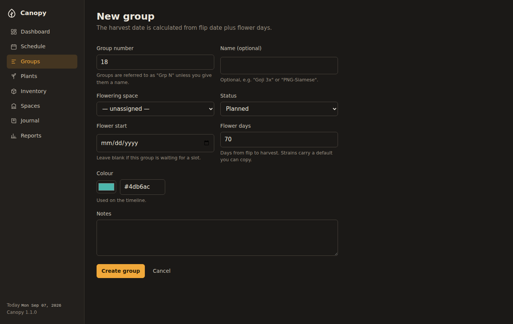

The next free group number and a timeline colour are pre‑filled. Leave *Flower start*
blank for a group that is waiting on a slot. When you arrive here from an opening link the
date and space are already set.

## Plants

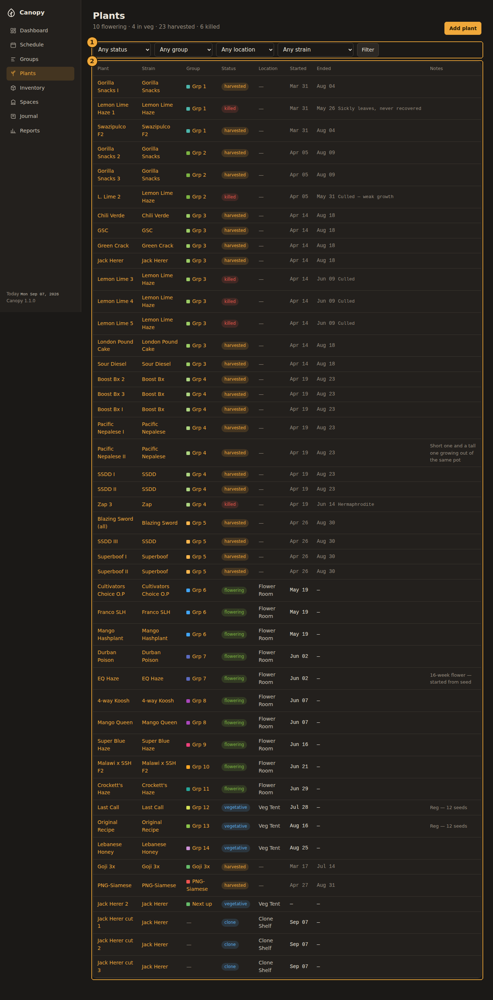

1. **Filters.** Combine status, group and strain.
2. **Table.** Strain and group are links; killed and harvested rows are dimmed and show
   the end date and reason.

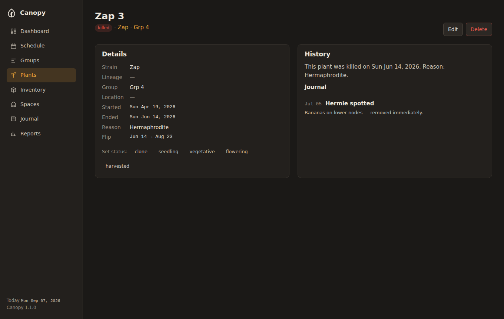

A plant page shows lineage, dates and the group's flip window; a killed plant shows its
history, a living one has a *Mark as killed* form with date and reason, and status
buttons for the normal lifecycle.

## Inventory

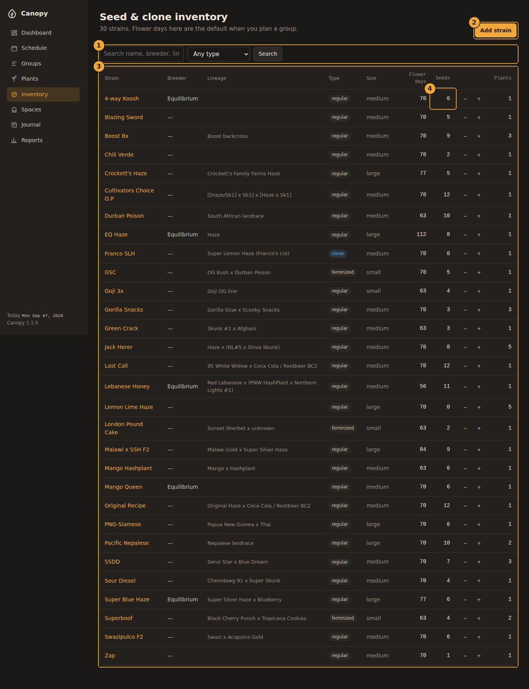

1. **Search and filter.** Free text over name, breeder and lineage, plus seed type,
   expression, breeder and flower-length filters. They stack: each one narrows what the
   others left.
2. **Add strain.**
3. **Table.** Seed type badge, expression (sativa / haze / indica / hybrid), size class,
   default flower days (copied into groups you plan), seeds on hand and the number of
   plants ever grown from the strain. Click any column header to sort by it; the default
   is strain name A–Z.
4. **Seed adjusters.** − / + change the count in place; it never drops below zero.

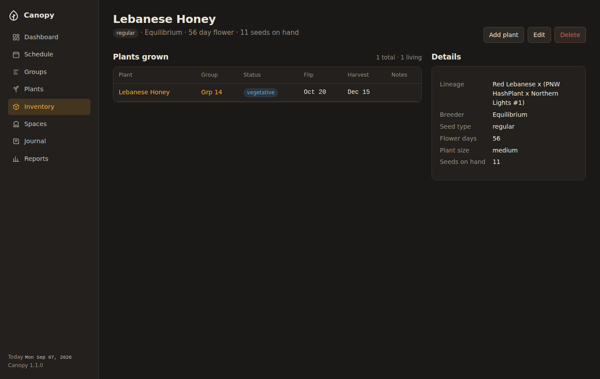

A strain page lists every plant grown from it with group, status, flip and harvest dates —
a quick way to see how a cultivar has performed across runs. A strain with plants can't be
deleted (delete the plants first) so history is never lost by accident.

## Spaces & planner

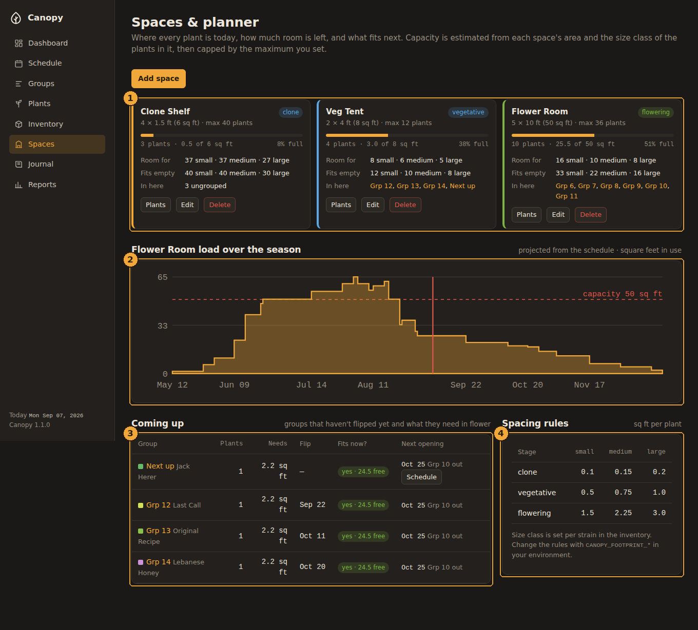

1. **One card per space**, ordered clone → veg → flower. Each shows stage, dimensions,
   maximum, a load bar (square feet in use, or plant count when there are no dimensions),
   how many *more* plants of each size fit right now, how many would fit empty, and which
   groups are in it. A space in breach — now or on a projected future date — gets a red
   **over capacity** label with the reason, and its border and load bar turn red.
2. **Load over the season** for each flowering space: square feet in use at every flip
   and harvest, the tent's area as a dashed capacity line, today in red. Peaks above the
   line are what drive the over-capacity label on the card.
3. **Coming up.** Every group that hasn't flipped yet, the square feet it will need in
   flower, whether that fits today, and the next opening. **Schedule** accepts the
   suggested date for unscheduled groups.
4. **Spacing rules** in effect (square feet per plant by stage and size class). Adjust
   with `CANOPY_FOOTPRINT_*`; set each strain's size class in the inventory.

### Setting up your spaces

Add one space per physical area — for example a clone shelf (stage *clone*, 4 × 1.5 ft,
max 40), a 2 × 4 veg tent (stage *vegetative*, max 12) and a 5 × 10 flower tent (stage
*flowering*, max 36). The maximum is a hard cap; the area estimate is a guide. Edit either
at any time from the space's **Edit** button.

### Moving plants through the tents

Pop seeds or take cuts → they sit on the clone shelf (status *clone* or *seedling*). Open
the group → **Move all living plants to Veg Tent**. When the flower tent opens, **Move all
living plants to Flower Room** — the group becomes flowering, its flip date is today, and
the timeline updates. Single plants can be moved from their own page.

## Journal

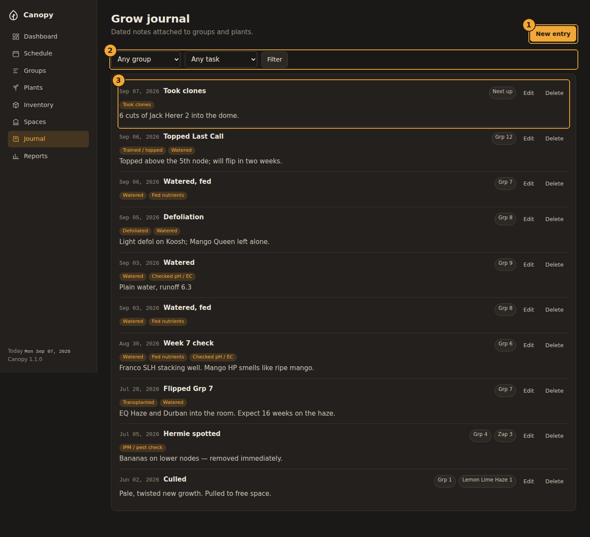

1. **New entry** for a longer note with a title and body (tasks optional).
2. **Filter** by space and by task — "show me every time I fed the flower tent".
3. Entries newest first, with task chips and a tag for the space, group or plant they
   were logged against.

The journal is deliberately inert: entries are yours to read, and nothing in the app
derives numbers or warnings from them.

Most days you won't open this page: the quick log on the dashboard and group pages is
the fast path.

## Reports

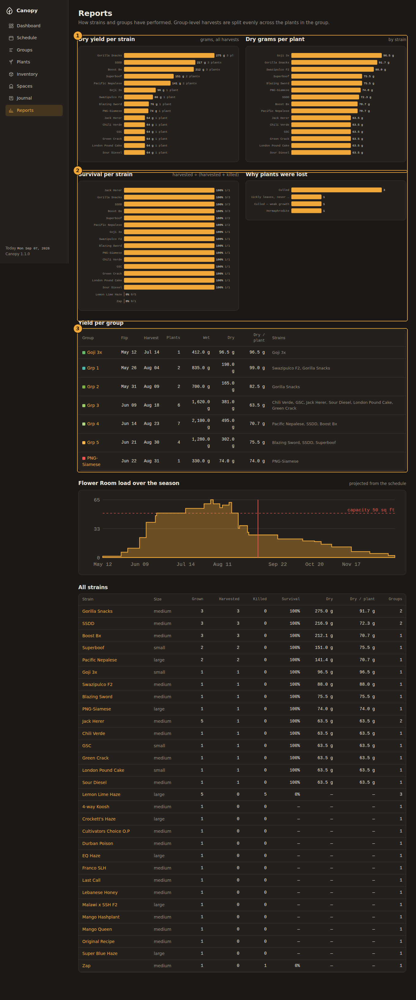

1. **Survival per strain** (harvested ÷ finished) and **why plants were lost**, from
   kill reasons.
2. The flower tent's load chart over the season, then a full per-strain table
   (size class, grown, harvested, killed, survival, groups).

## Print view

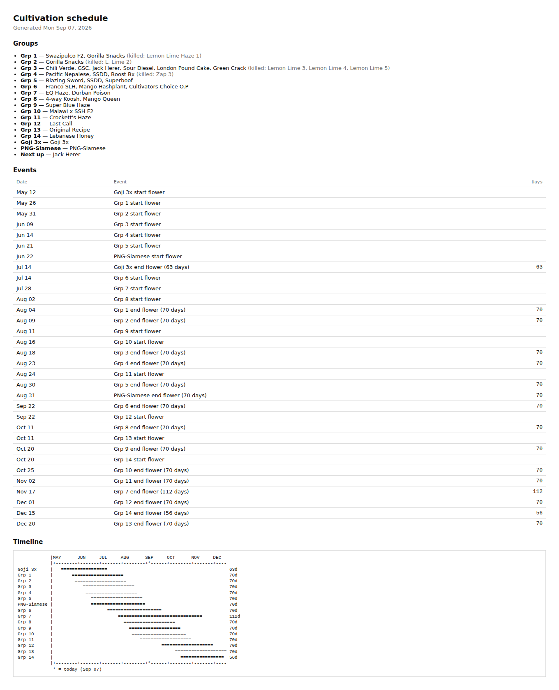

A black‑on‑white page with the group list, event table and ASCII timeline. It opens the
browser print dialog automatically.

## On a phone

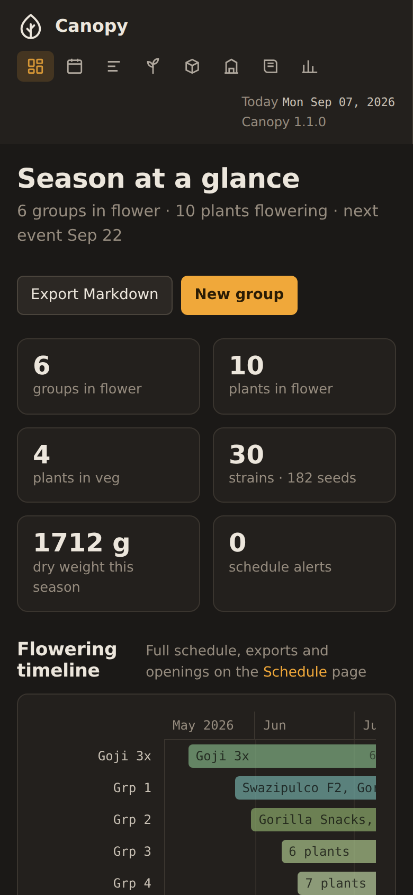

The sidebar becomes a top bar, panels stack, and the timeline scrolls sideways inside its
panel.

## Everyday workflows

**Plan the next run.** Inventory → pick strains (check their size class) → Groups →
*New group* (leave the date blank) → *Add plant* for each seed you pop → the group appears
under *Waiting for a slot* with a suggested date and in the planner's *Coming up* table
with the square feet it needs → **Schedule**.

**Daily.** Dashboard → *Log today* → pick the tent, tick watered / fed → **Log**. Ten seconds.

**Move a group up a stage.** Group page → *Move all living plants to* → the next tent.

**Flip day.** Open the group → *flowering*. Plants move with it and the timeline updates.

**Lose a plant.** Group page → **Kill**, or the plant page for a specific date and reason.

**Harvest.** Group page → *drying* (plants become harvested) → *Record a harvest* with
weights → later *done* to archive it from the active list.

**Keep your notes app current.** Schedule → *Export Markdown* and paste; or
`flask --app wsgi export-markdown > schedule.md`.

**Back up.** Schedule → *Backup JSON*. Keep the file somewhere safe; *Restore…* brings it
back on any machine.
